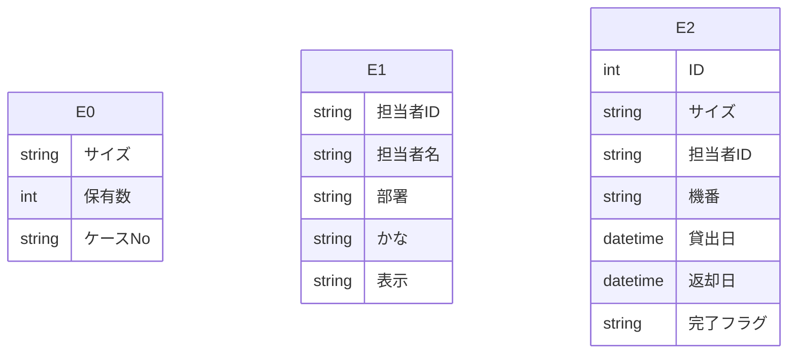

# Access データベース・スキーマ抽出レポート

このファイルは **Access の ODBC メタデータ**から自動生成しました。
LLM に渡す場合は **「スキーマ JSON」セクション**と **「PostgreSQL DDL 草案」**をあわせて指示に含めると、目的の RDB に近い定義を再現しやすくなります。

## LLM / AI 向け: このドキュメントの使い方

以下をプロンプトにコピーして、目的の SQL ダイアレクト（例: PostgreSQL）向け **CREATE TABLE・INDEX・FK** を生成させてください。

```text
あなたはデータベース設計者です。添付 Markdown の次を根拠に、一貫したリレーショナルスキーマを設計してください。
1) YAML フロントマターと「サマリー」の数値
2) 「スキーマ JSON（機械可読・全量）」の tables / relationships / warnings
3) 「PostgreSQL DDL 草案」は参考用。型・NULL・FK・インデックスを JSON・列定義と突き合わせて修正すること。
4) ODBC が SYNONYM としたテーブルはリンク元の実体が別にある場合がある。移行時はデータ取得元を明示すること。
5) relationships が空のときは、列名・サンプルデータから FK を推論してよいが、推論はコメントで区別すること。
出力: (a) 最終 DDL (b) 設計上の想定・未確定事項の箇条書き
```

> ⚠ FK 取得スキップ: t_PGマスタ — ('IM001', '[IM001] [Microsoft][ODBC Driver Manager] ドライバーはこの関数をサポートしていません。 (0) (SQLForeignKeys)')
> ⚠ FK 取得スキップ: t_担当者マスタ — ('IM001', '[IM001] [Microsoft][ODBC Driver Manager] ドライバーはこの関数をサポートしていません。 (0) (SQLForeignKeys)')
> ⚠ FK 取得スキップ: t_貸出 — ('IM001', '[IM001] [Microsoft][ODBC Driver Manager] ドライバーはこの関数をサポートしていません。 (0) (SQLForeignKeys)')
> ⚠ VBA 抽出失敗: (-2147352567, '例外が発生しました。', (0, None, '指定した式に、Visible プロパティに対する正しくない参照が含まれます。', 'dao360.chm', 2015567, -2146825833), None)

## サマリー

| 項目 | 値 |
|---|---|
| Access ファイル | `\\192.168.1.200\共有\生産管理課\AccessDB\ピンゲージ管理DB.accdb` |
| ODBC ドライバ | `Microsoft Access Driver (*.mdb, *.accdb)` |
| テーブル数 | 3 |
| 行数合計（取得できたテーブルのみ） | 34,288 |
| リンクテーブル相当（ODBC: SYNONYM） | 0 |
| 外部キー（検出分） | 0 |
| ビュー / クエリ名 | 0 |
| 警告 | 4 |

## ER 図（Mermaid・参考）

Mermaid 内のエンティティは `E0`, `E1`, … です。実テーブル名は次の対応表を参照してください。

| 記号 | テーブル名 | ODBC 型 | 行数 |
|---|---|---:|---:|
| E0 | `t_PGマスタ` | TABLE | 2,030 |
| E1 | `t_担当者マスタ` | TABLE | 29 |
| E2 | `t_貸出` | TABLE | 32,229 |



## PostgreSQL DDL 草案（全文・自動生成）

```sql
-- PostgreSQL DDL 草案（Access メタデータから自動生成）
-- ※ 型・制約は必ず手動で確認・修正してください

CREATE TABLE "t_PGマスタ" (
    "サイズ" VARCHAR(20),
    "保有数" INTEGER,
    "ケースNo" VARCHAR(5)
);


CREATE TABLE "t_担当者マスタ" (
    "担当者ID" VARCHAR(2),
    "担当者名" VARCHAR(5),
    "部署" VARCHAR(2),
    "かな" VARCHAR(1),
    "表示" VARCHAR(1)
);


CREATE TABLE "t_貸出" (
    "ID" BIGSERIAL,
    "サイズ" VARCHAR(20),
    "担当者ID" VARCHAR(2),
    "機番" VARCHAR(4),
    "貸出日" TIMESTAMP,
    "返却日" TIMESTAMP,
    "完了フラグ" VARCHAR(1)
);
```

## スキーマ JSON（機械可読・全量）

以下をパースすれば、テーブル・列・PK・インデックス・サンプル・統計・FK・ビュー名を一括で渡せます。

```json
{
  "export_spec": "access-inspector/schema-export/v1",
  "generated_at": "2026-06-15T00:11:52.604245+00:00",
  "source": {
    "database_path": "\\\\192.168.1.200\\共有\\生産管理課\\AccessDB\\ピンゲージ管理DB.accdb",
    "driver_used": "Microsoft Access Driver (*.mdb, *.accdb)"
  },
  "summary": {
    "table_count": 3,
    "sum_row_count_where_known": 34288,
    "tables_with_row_count": 3,
    "linked_table_odbc_synonym_count": 0,
    "relationship_count": 0,
    "view_count": 0,
    "warning_count": 4
  },
  "notes_for_consumer": [
    "ODBC の table_type が SYNONYM のテーブルは Access のリンクテーブルであることが多い。",
    "PostgreSQL 型ヒントは参考。最終 DDL は業務要件とデータ実態で確認すること。",
    "relationships が空でも、命名規則やサンプル行から推定された FK があり得る。"
  ],
  "tables": [
    {
      "name": "t_PGマスタ",
      "table_type": "TABLE",
      "row_count": 2030,
      "row_count_error": null,
      "primary_key": [],
      "columns": [
        {
          "name": "サイズ",
          "access_type": "VARCHAR",
          "sql_data_type": -9,
          "column_size": 20,
          "decimal_digits": null,
          "nullable": true,
          "postgres_type_hint": "VARCHAR(20)"
        },
        {
          "name": "保有数",
          "access_type": "INTEGER",
          "sql_data_type": 4,
          "column_size": 10,
          "decimal_digits": 0,
          "nullable": true,
          "postgres_type_hint": "INTEGER"
        },
        {
          "name": "ケースNo",
          "access_type": "VARCHAR",
          "sql_data_type": -9,
          "column_size": 5,
          "decimal_digits": null,
          "nullable": true,
          "postgres_type_hint": "VARCHAR(5)"
        }
      ],
      "indexes": [],
      "sample_headers": [
        "サイズ",
        "保有数",
        "ケースNo"
      ],
      "sample_rows": [
        [
          "0.130",
          1,
          "C01"
        ],
        [
          "0.150",
          1,
          "C01"
        ],
        [
          "0.170",
          1,
          "C01"
        ],
        [
          "0.180",
          1,
          "C01"
        ],
        [
          "0.190",
          1,
          "C01"
        ]
      ],
      "column_stats": [
        {
          "column": "サイズ",
          "null_count": 0,
          "null_rate_pct": 0.0,
          "unique_count": null,
          "unique_rate_pct": null
        },
        {
          "column": "保有数",
          "null_count": 0,
          "null_rate_pct": 0.0,
          "unique_count": null,
          "unique_rate_pct": null
        },
        {
          "column": "ケースNo",
          "null_count": 7,
          "null_rate_pct": 0.3,
          "unique_count": null,
          "unique_rate_pct": null
        }
      ]
    },
    {
      "name": "t_担当者マスタ",
      "table_type": "TABLE",
      "row_count": 29,
      "row_count_error": null,
      "primary_key": [],
      "columns": [
        {
          "name": "担当者ID",
          "access_type": "VARCHAR",
          "sql_data_type": -9,
          "column_size": 2,
          "decimal_digits": null,
          "nullable": true,
          "postgres_type_hint": "VARCHAR(2)"
        },
        {
          "name": "担当者名",
          "access_type": "VARCHAR",
          "sql_data_type": -9,
          "column_size": 5,
          "decimal_digits": null,
          "nullable": true,
          "postgres_type_hint": "VARCHAR(5)"
        },
        {
          "name": "部署",
          "access_type": "VARCHAR",
          "sql_data_type": -9,
          "column_size": 2,
          "decimal_digits": null,
          "nullable": true,
          "postgres_type_hint": "VARCHAR(2)"
        },
        {
          "name": "かな",
          "access_type": "VARCHAR",
          "sql_data_type": -9,
          "column_size": 1,
          "decimal_digits": null,
          "nullable": true,
          "postgres_type_hint": "VARCHAR(1)"
        },
        {
          "name": "表示",
          "access_type": "VARCHAR",
          "sql_data_type": -9,
          "column_size": 1,
          "decimal_digits": null,
          "nullable": true,
          "postgres_type_hint": "VARCHAR(1)"
        }
      ],
      "indexes": [],
      "sample_headers": [
        "担当者ID",
        "担当者名",
        "部署",
        "かな",
        "表示"
      ],
      "sample_rows": [
        [
          "01",
          "高田",
          "製造",
          "た",
          "Y"
        ],
        [
          "02",
          "斉藤",
          "製造",
          "さ",
          "Y"
        ],
        [
          "03",
          "加隝",
          "製造",
          "か",
          "Y"
        ],
        [
          "04",
          "今井",
          "製造",
          "い",
          "Y"
        ],
        [
          "05",
          "高橋拓",
          "製造",
          "た",
          "Y"
        ]
      ],
      "column_stats": [
        {
          "column": "担当者ID",
          "null_count": 0,
          "null_rate_pct": 0.0,
          "unique_count": null,
          "unique_rate_pct": null
        },
        {
          "column": "担当者名",
          "null_count": 0,
          "null_rate_pct": 0.0,
          "unique_count": null,
          "unique_rate_pct": null
        },
        {
          "column": "部署",
          "null_count": 0,
          "null_rate_pct": 0.0,
          "unique_count": null,
          "unique_rate_pct": null
        },
        {
          "column": "かな",
          "null_count": 0,
          "null_rate_pct": 0.0,
          "unique_count": null,
          "unique_rate_pct": null
        },
        {
          "column": "表示",
          "null_count": 0,
          "null_rate_pct": 0.0,
          "unique_count": null,
          "unique_rate_pct": null
        }
      ]
    },
    {
      "name": "t_貸出",
      "table_type": "TABLE",
      "row_count": 32229,
      "row_count_error": null,
      "primary_key": [],
      "columns": [
        {
          "name": "ID",
          "access_type": "COUNTER",
          "sql_data_type": 4,
          "column_size": 10,
          "decimal_digits": 0,
          "nullable": false,
          "postgres_type_hint": "BIGSERIAL"
        },
        {
          "name": "サイズ",
          "access_type": "VARCHAR",
          "sql_data_type": -9,
          "column_size": 20,
          "decimal_digits": null,
          "nullable": true,
          "postgres_type_hint": "VARCHAR(20)"
        },
        {
          "name": "担当者ID",
          "access_type": "VARCHAR",
          "sql_data_type": -9,
          "column_size": 2,
          "decimal_digits": null,
          "nullable": true,
          "postgres_type_hint": "VARCHAR(2)"
        },
        {
          "name": "機番",
          "access_type": "VARCHAR",
          "sql_data_type": -9,
          "column_size": 4,
          "decimal_digits": null,
          "nullable": true,
          "postgres_type_hint": "VARCHAR(4)"
        },
        {
          "name": "貸出日",
          "access_type": "DATETIME",
          "sql_data_type": 9,
          "column_size": 19,
          "decimal_digits": 0,
          "nullable": true,
          "postgres_type_hint": "TIMESTAMP"
        },
        {
          "name": "返却日",
          "access_type": "DATETIME",
          "sql_data_type": 9,
          "column_size": 19,
          "decimal_digits": 0,
          "nullable": true,
          "postgres_type_hint": "TIMESTAMP"
        },
        {
          "name": "完了フラグ",
          "access_type": "VARCHAR",
          "sql_data_type": -9,
          "column_size": 1,
          "decimal_digits": null,
          "nullable": true,
          "postgres_type_hint": "VARCHAR(1)"
        }
      ],
      "indexes": [],
      "sample_headers": [
        "ID",
        "サイズ",
        "担当者ID",
        "機番",
        "貸出日",
        "返却日",
        "完了フラグ"
      ],
      "sample_rows": [
        [
          58,
          "6.25",
          "05",
          "返-7",
          "2021-06-11T00:00:00",
          "2021-11-15T00:00:00",
          "Y"
        ],
        [
          59,
          "3.11",
          "05",
          "返-7",
          "2021-06-11T00:00:00",
          "2021-11-15T00:00:00",
          "Y"
        ],
        [
          60,
          "4.21",
          "05",
          "返-7",
          "2021-06-11T00:00:00",
          "2021-11-15T00:00:00",
          "Y"
        ],
        [
          80,
          "1.0",
          "10",
          "返-1",
          "2021-06-30T00:00:00",
          "2021-07-09T00:00:00",
          "Y"
        ],
        [
          81,
          "1.3",
          "10",
          "返-1",
          "2021-06-30T00:00:00",
          "2021-07-09T00:00:00",
          "Y"
        ]
      ],
      "column_stats": [
        {
          "column": "ID",
          "null_count": 0,
          "null_rate_pct": 0.0,
          "unique_count": null,
          "unique_rate_pct": null
        },
        {
          "column": "サイズ",
          "null_count": 0,
          "null_rate_pct": 0.0,
          "unique_count": null,
          "unique_rate_pct": null
        },
        {
          "column": "担当者ID",
          "null_count": 0,
          "null_rate_pct": 0.0,
          "unique_count": null,
          "unique_rate_pct": null
        },
        {
          "column": "機番",
          "null_count": 0,
          "null_rate_pct": 0.0,
          "unique_count": null,
          "unique_rate_pct": null
        },
        {
          "column": "貸出日",
          "null_count": 0,
          "null_rate_pct": 0.0,
          "unique_count": null,
          "unique_rate_pct": null
        },
        {
          "column": "返却日",
          "null_count": 442,
          "null_rate_pct": 1.4,
          "unique_count": null,
          "unique_rate_pct": null
        },
        {
          "column": "完了フラグ",
          "null_count": 411,
          "null_rate_pct": 1.3,
          "unique_count": null,
          "unique_rate_pct": null
        }
      ]
    }
  ],
  "relationships": [],
  "views_and_queries": [],
  "vba_modules": [],
  "warnings": [
    "FK 取得スキップ: t_PGマスタ — ('IM001', '[IM001] [Microsoft][ODBC Driver Manager] ドライバーはこの関数をサポートしていません。 (0) (SQLForeignKeys)')",
    "FK 取得スキップ: t_担当者マスタ — ('IM001', '[IM001] [Microsoft][ODBC Driver Manager] ドライバーはこの関数をサポートしていません。 (0) (SQLForeignKeys)')",
    "FK 取得スキップ: t_貸出 — ('IM001', '[IM001] [Microsoft][ODBC Driver Manager] ドライバーはこの関数をサポートしていません。 (0) (SQLForeignKeys)')",
    "VBA 抽出失敗: (-2147352567, '例外が発生しました。', (0, None, '指定した式に、Visible プロパティに対する正しくない参照が含まれます。', 'dao360.chm', 2015567, -2146825833), None)"
  ]
}
```

## テーブル一覧

| テーブル | ODBC 型 | 行数 | PK | インデックス数 |
|---|---|---:|---|---:|
| `t_PGマスタ` | TABLE | 2,030 | — | 0 |
| `t_担当者マスタ` | TABLE | 29 | — | 0 |
| `t_貸出` | TABLE | 32,229 | — | 0 |

## カラム詳細

### `t_PGマスタ`

- **ODBC テーブル種別**: TABLE
- **行数**: 2,030

| 列 | Access 型 | PG 型ヒント | sql_data_type | サイズ | 小数 | NULL | PK |
|---|---|---|---:|---:|---:|:---:|:---:|
| サイズ | VARCHAR | VARCHAR(20) | -9 | 20 |  | ○ |  |
| 保有数 | INTEGER | INTEGER | 4 | 10 | 0 | ○ |  |
| ケースNo | VARCHAR | VARCHAR(5) | -9 | 5 |  | ○ |  |

**カラム統計**

| 列 | NULL件数 | NULL率% | ユニーク件数 | ユニーク率% |
|---|---:|---:|---:|---:|
| サイズ | 0 | 0.0 | None | None |
| 保有数 | 0 | 0.0 | None | None |
| ケースNo | 7 | 0.3 | None | None |

**サンプルデータ（先頭数行）**

| サイズ | 保有数 | ケースNo |
|---|---|---|
| 0.130 | 1 | C01 |
| 0.150 | 1 | C01 |
| 0.170 | 1 | C01 |
| 0.180 | 1 | C01 |
| 0.190 | 1 | C01 |

### `t_担当者マスタ`

- **ODBC テーブル種別**: TABLE
- **行数**: 29

| 列 | Access 型 | PG 型ヒント | sql_data_type | サイズ | 小数 | NULL | PK |
|---|---|---|---:|---:|---:|:---:|:---:|
| 担当者ID | VARCHAR | VARCHAR(2) | -9 | 2 |  | ○ |  |
| 担当者名 | VARCHAR | VARCHAR(5) | -9 | 5 |  | ○ |  |
| 部署 | VARCHAR | VARCHAR(2) | -9 | 2 |  | ○ |  |
| かな | VARCHAR | VARCHAR(1) | -9 | 1 |  | ○ |  |
| 表示 | VARCHAR | VARCHAR(1) | -9 | 1 |  | ○ |  |

**カラム統計**

| 列 | NULL件数 | NULL率% | ユニーク件数 | ユニーク率% |
|---|---:|---:|---:|---:|
| 担当者ID | 0 | 0.0 | None | None |
| 担当者名 | 0 | 0.0 | None | None |
| 部署 | 0 | 0.0 | None | None |
| かな | 0 | 0.0 | None | None |
| 表示 | 0 | 0.0 | None | None |

**サンプルデータ（先頭数行）**

| 担当者ID | 担当者名 | 部署 | かな | 表示 |
|---|---|---|---|---|
| 01 | 高田 | 製造 | た | Y |
| 02 | 斉藤 | 製造 | さ | Y |
| 03 | 加隝 | 製造 | か | Y |
| 04 | 今井 | 製造 | い | Y |
| 05 | 高橋拓 | 製造 | た | Y |

### `t_貸出`

- **ODBC テーブル種別**: TABLE
- **行数**: 32,229

| 列 | Access 型 | PG 型ヒント | sql_data_type | サイズ | 小数 | NULL | PK |
|---|---|---|---:|---:|---:|:---:|:---:|
| ID | COUNTER | BIGSERIAL | 4 | 10 | 0 | × |  |
| サイズ | VARCHAR | VARCHAR(20) | -9 | 20 |  | ○ |  |
| 担当者ID | VARCHAR | VARCHAR(2) | -9 | 2 |  | ○ |  |
| 機番 | VARCHAR | VARCHAR(4) | -9 | 4 |  | ○ |  |
| 貸出日 | DATETIME | TIMESTAMP | 9 | 19 | 0 | ○ |  |
| 返却日 | DATETIME | TIMESTAMP | 9 | 19 | 0 | ○ |  |
| 完了フラグ | VARCHAR | VARCHAR(1) | -9 | 1 |  | ○ |  |

**カラム統計**

| 列 | NULL件数 | NULL率% | ユニーク件数 | ユニーク率% |
|---|---:|---:|---:|---:|
| ID | 0 | 0.0 | None | None |
| サイズ | 0 | 0.0 | None | None |
| 担当者ID | 0 | 0.0 | None | None |
| 機番 | 0 | 0.0 | None | None |
| 貸出日 | 0 | 0.0 | None | None |
| 返却日 | 442 | 1.4 | None | None |
| 完了フラグ | 411 | 1.3 | None | None |

**サンプルデータ（先頭数行）**

| ID | サイズ | 担当者ID | 機番 | 貸出日 | 返却日 | 完了フラグ |
|---|---|---|---|---|---|---|
| 58 | 6.25 | 05 | 返-7 | 2021-06-11T00:00:00 | 2021-11-15T00:00:00 | Y |
| 59 | 3.11 | 05 | 返-7 | 2021-06-11T00:00:00 | 2021-11-15T00:00:00 | Y |
| 60 | 4.21 | 05 | 返-7 | 2021-06-11T00:00:00 | 2021-11-15T00:00:00 | Y |
| 80 | 1.0 | 10 | 返-1 | 2021-06-30T00:00:00 | 2021-07-09T00:00:00 | Y |
| 81 | 1.3 | 10 | 返-1 | 2021-06-30T00:00:00 | 2021-07-09T00:00:00 | Y |

## リレーション（外部キー）

（検出なし、またはドライバが FK メタデータを返しませんでした）

## ビュー / クエリ

（なし）

## VBA モジュール

（取得なし — オプションで「VBAコードを取得」を有効にして再取得してください）
