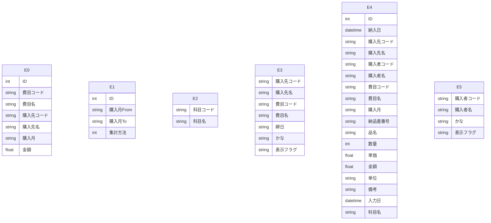

# Access データベース・スキーマ抽出レポート

このファイルは **Access の ODBC メタデータ**から自動生成しました。
LLM に渡す場合は **「スキーマ JSON」セクション**と **「PostgreSQL DDL 草案」**をあわせて指示に含めると、目的の RDB に近い定義を再現しやすくなります。

## LLM / AI 向け: このドキュメントの使い方

以下をプロンプトにコピーして、目的の SQL ダイアレクト（例: PostgreSQL）向け **CREATE TABLE・INDEX・FK** を生成させてください。

```text
あなたはデータベース設計者です。添付 Markdown の次を根拠に、一貫したリレーショナルスキーマを設計してください。
1) YAML フロントマターと「サマリー」の数値
2) 「スキーマ JSON（機械可読・全量）」の tables / relationships / warnings
3) 「PostgreSQL DDL 草案」は参考用。型・NULL・FK・インデックスを JSON・列定義と突き合わせて修正すること。
4) ODBC が SYNONYM としたテーブルはリンク元の実体が別にある場合がある。移行時はデータ取得元を明示すること。
5) relationships が空のときは、列名・サンプルデータから FK を推論してよいが、推論はコメントで区別すること。
出力: (a) 最終 DDL (b) 設計上の想定・未確定事項の箇条書き
```

> ⚠ FK 取得スキップ: t_クロス集計用 — ('IM001', '[IM001] [Microsoft][ODBC Driver Manager] ドライバーはこの関数をサポートしていません。 (0) (SQLForeignKeys)')
> ⚠ FK 取得スキップ: t_コントロール — ('IM001', '[IM001] [Microsoft][ODBC Driver Manager] ドライバーはこの関数をサポートしていません。 (0) (SQLForeignKeys)')
> ⚠ FK 取得スキップ: t_科目名マスタ — ('IM001', '[IM001] [Microsoft][ODBC Driver Manager] ドライバーはこの関数をサポートしていません。 (0) (SQLForeignKeys)')
> ⚠ FK 取得スキップ: t_購入先マスタ — ('IM001', '[IM001] [Microsoft][ODBC Driver Manager] ドライバーはこの関数をサポートしていません。 (0) (SQLForeignKeys)')
> ⚠ FK 取得スキップ: t_購入品明細 — ('IM001', '[IM001] [Microsoft][ODBC Driver Manager] ドライバーはこの関数をサポートしていません。 (0) (SQLForeignKeys)')
> ⚠ FK 取得スキップ: t_購入者マスタ — ('IM001', '[IM001] [Microsoft][ODBC Driver Manager] ドライバーはこの関数をサポートしていません。 (0) (SQLForeignKeys)')

## サマリー

| 項目 | 値 |
|---|---|
| Access ファイル | `\\192.168.1.200\共有\生産管理課\AccessDB\購入品集計DB.accdb` |
| ODBC ドライバ | `Microsoft Access Driver (*.mdb, *.accdb)` |
| テーブル数 | 6 |
| 行数合計（取得できたテーブルのみ） | 45,755 |
| リンクテーブル相当（ODBC: SYNONYM） | 0 |
| 外部キー（検出分） | 0 |
| ビュー / クエリ名 | 0 |
| 警告 | 6 |

## ER 図（Mermaid・参考）

Mermaid 内のエンティティは `E0`, `E1`, … です。実テーブル名は次の対応表を参照してください。

| 記号 | テーブル名 | ODBC 型 | 行数 |
|---|---|---:|---:|
| E0 | `t_クロス集計用` | TABLE | 25 |
| E1 | `t_コントロール` | TABLE | 1 |
| E2 | `t_科目名マスタ` | TABLE | 19 |
| E3 | `t_購入先マスタ` | TABLE | 84 |
| E4 | `t_購入品明細` | TABLE | 45,582 |
| E5 | `t_購入者マスタ` | TABLE | 44 |



## PostgreSQL DDL 草案（全文・自動生成）

```sql
-- PostgreSQL DDL 草案（Access メタデータから自動生成）
-- ※ 型・制約は必ず手動で確認・修正してください

CREATE TABLE "t_クロス集計用" (
    "ID" BIGSERIAL,
    "費目コード" VARCHAR(2),
    "費目名" VARCHAR(30),
    "購入先コード" VARCHAR(3),
    "購入先名" VARCHAR(30),
    "購入月" VARCHAR(4),
    "金額" NUMERIC(19,4)
);


CREATE TABLE "t_コントロール" (
    "ID" BIGSERIAL,
    "購入月From" VARCHAR(4),
    "購入月To" VARCHAR(4),
    "集計方法" INTEGER
);


CREATE TABLE "t_科目名マスタ" (
    "科目コード" VARCHAR(2),
    "科目名" VARCHAR(6)
);


CREATE TABLE "t_購入先マスタ" (
    "購入先コード" VARCHAR(3),
    "購入先名" VARCHAR(20),
    "費目コード" VARCHAR(2),
    "費目名" VARCHAR(10),
    "締日" VARCHAR(2),
    "かな" VARCHAR(1),
    "表示フラグ" VARCHAR(1)
);


CREATE TABLE "t_購入品明細" (
    "ID" BIGSERIAL,
    "納入日" TIMESTAMP,
    "購入先コード" VARCHAR(3),
    "購入先名" VARCHAR(30),
    "購入者コード" VARCHAR(3),
    "購入者名" VARCHAR(30),
    "費目コード" VARCHAR(2),
    "費目名" VARCHAR(10),
    "購入月" VARCHAR(4),
    "納品書番号" VARCHAR(15),
    "品名" VARCHAR(60),
    "数量" INTEGER,
    "単価" DOUBLE PRECISION,
    "金額" NUMERIC(19,4),
    "単位" VARCHAR(5),
    "備考" VARCHAR(30),
    "入力日" TIMESTAMP,
    "科目名" VARCHAR(6)
);


CREATE TABLE "t_購入者マスタ" (
    "購入者コード" VARCHAR(3),
    "購入者名" VARCHAR(10),
    "かな" VARCHAR(1),
    "表示フラグ" VARCHAR(1)
);
```

## スキーマ JSON（機械可読・全量）

以下をパースすれば、テーブル・列・PK・インデックス・サンプル・統計・FK・ビュー名を一括で渡せます。

```json
{
  "export_spec": "access-inspector/schema-export/v1",
  "generated_at": "2026-06-16T00:10:48.448408+00:00",
  "source": {
    "database_path": "\\\\192.168.1.200\\共有\\生産管理課\\AccessDB\\購入品集計DB.accdb",
    "driver_used": "Microsoft Access Driver (*.mdb, *.accdb)"
  },
  "summary": {
    "table_count": 6,
    "sum_row_count_where_known": 45755,
    "tables_with_row_count": 6,
    "linked_table_odbc_synonym_count": 0,
    "relationship_count": 0,
    "view_count": 0,
    "warning_count": 6
  },
  "notes_for_consumer": [
    "ODBC の table_type が SYNONYM のテーブルは Access のリンクテーブルであることが多い。",
    "PostgreSQL 型ヒントは参考。最終 DDL は業務要件とデータ実態で確認すること。",
    "relationships が空でも、命名規則やサンプル行から推定された FK があり得る。"
  ],
  "tables": [
    {
      "name": "t_クロス集計用",
      "table_type": "TABLE",
      "row_count": 25,
      "row_count_error": null,
      "primary_key": [],
      "columns": [
        {
          "name": "ID",
          "access_type": "COUNTER",
          "sql_data_type": 4,
          "column_size": 10,
          "decimal_digits": 0,
          "nullable": false,
          "postgres_type_hint": "BIGSERIAL"
        },
        {
          "name": "費目コード",
          "access_type": "VARCHAR",
          "sql_data_type": -9,
          "column_size": 2,
          "decimal_digits": null,
          "nullable": true,
          "postgres_type_hint": "VARCHAR(2)"
        },
        {
          "name": "費目名",
          "access_type": "VARCHAR",
          "sql_data_type": -9,
          "column_size": 30,
          "decimal_digits": null,
          "nullable": true,
          "postgres_type_hint": "VARCHAR(30)"
        },
        {
          "name": "購入先コード",
          "access_type": "VARCHAR",
          "sql_data_type": -9,
          "column_size": 3,
          "decimal_digits": null,
          "nullable": true,
          "postgres_type_hint": "VARCHAR(3)"
        },
        {
          "name": "購入先名",
          "access_type": "VARCHAR",
          "sql_data_type": -9,
          "column_size": 30,
          "decimal_digits": null,
          "nullable": true,
          "postgres_type_hint": "VARCHAR(30)"
        },
        {
          "name": "購入月",
          "access_type": "VARCHAR",
          "sql_data_type": -9,
          "column_size": 4,
          "decimal_digits": null,
          "nullable": true,
          "postgres_type_hint": "VARCHAR(4)"
        },
        {
          "name": "金額",
          "access_type": "CURRENCY",
          "sql_data_type": 2,
          "column_size": 19,
          "decimal_digits": 4,
          "nullable": true,
          "postgres_type_hint": "NUMERIC(19,4)"
        }
      ],
      "indexes": [],
      "sample_headers": [
        "ID",
        "費目コード",
        "費目名",
        "購入先コード",
        "購入先名",
        "購入月",
        "金額"
      ],
      "sample_rows": [
        [
          10175,
          "10",
          "工具費",
          "101",
          "棒柘産業 ㈱",
          "2304",
          "1827119.0000"
        ],
        [
          10176,
          "10",
          "工具費",
          "102",
          "㈱ まじま機工",
          "2304",
          "338230.0000"
        ],
        [
          10177,
          "10",
          "工具費",
          "106",
          "岩瀬産業㈱",
          "2304",
          "734512.0000"
        ],
        [
          10178,
          "10",
          "工具費",
          "107",
          "㈱佐藤機工",
          "2304",
          "145006.0000"
        ],
        [
          10179,
          "10",
          "工具費",
          "109",
          "㈱CJVインターナショナル",
          "2304",
          "469800.0000"
        ]
      ],
      "column_stats": [
        {
          "column": "ID",
          "null_count": 0,
          "null_rate_pct": 0.0,
          "unique_count": null,
          "unique_rate_pct": null
        },
        {
          "column": "費目コード",
          "null_count": 0,
          "null_rate_pct": 0.0,
          "unique_count": null,
          "unique_rate_pct": null
        },
        {
          "column": "費目名",
          "null_count": 0,
          "null_rate_pct": 0.0,
          "unique_count": null,
          "unique_rate_pct": null
        },
        {
          "column": "購入先コード",
          "null_count": 0,
          "null_rate_pct": 0.0,
          "unique_count": null,
          "unique_rate_pct": null
        },
        {
          "column": "購入先名",
          "null_count": 0,
          "null_rate_pct": 0.0,
          "unique_count": null,
          "unique_rate_pct": null
        },
        {
          "column": "購入月",
          "null_count": 0,
          "null_rate_pct": 0.0,
          "unique_count": null,
          "unique_rate_pct": null
        },
        {
          "column": "金額",
          "null_count": 0,
          "null_rate_pct": 0.0,
          "unique_count": null,
          "unique_rate_pct": null
        }
      ]
    },
    {
      "name": "t_コントロール",
      "table_type": "TABLE",
      "row_count": 1,
      "row_count_error": null,
      "primary_key": [],
      "columns": [
        {
          "name": "ID",
          "access_type": "COUNTER",
          "sql_data_type": 4,
          "column_size": 10,
          "decimal_digits": 0,
          "nullable": false,
          "postgres_type_hint": "BIGSERIAL"
        },
        {
          "name": "購入月From",
          "access_type": "VARCHAR",
          "sql_data_type": -9,
          "column_size": 4,
          "decimal_digits": null,
          "nullable": true,
          "postgres_type_hint": "VARCHAR(4)"
        },
        {
          "name": "購入月To",
          "access_type": "VARCHAR",
          "sql_data_type": -9,
          "column_size": 4,
          "decimal_digits": null,
          "nullable": true,
          "postgres_type_hint": "VARCHAR(4)"
        },
        {
          "name": "集計方法",
          "access_type": "INTEGER",
          "sql_data_type": 4,
          "column_size": 10,
          "decimal_digits": 0,
          "nullable": true,
          "postgres_type_hint": "INTEGER"
        }
      ],
      "indexes": [],
      "sample_headers": [
        "ID",
        "購入月From",
        "購入月To",
        "集計方法"
      ],
      "sample_rows": [
        [
          1,
          "2304",
          "2304",
          2
        ]
      ],
      "column_stats": [
        {
          "column": "ID",
          "null_count": 0,
          "null_rate_pct": 0.0,
          "unique_count": null,
          "unique_rate_pct": null
        },
        {
          "column": "購入月From",
          "null_count": 0,
          "null_rate_pct": 0.0,
          "unique_count": null,
          "unique_rate_pct": null
        },
        {
          "column": "購入月To",
          "null_count": 0,
          "null_rate_pct": 0.0,
          "unique_count": null,
          "unique_rate_pct": null
        },
        {
          "column": "集計方法",
          "null_count": 0,
          "null_rate_pct": 0.0,
          "unique_count": null,
          "unique_rate_pct": null
        }
      ]
    },
    {
      "name": "t_科目名マスタ",
      "table_type": "TABLE",
      "row_count": 19,
      "row_count_error": null,
      "primary_key": [],
      "columns": [
        {
          "name": "科目コード",
          "access_type": "VARCHAR",
          "sql_data_type": -9,
          "column_size": 2,
          "decimal_digits": null,
          "nullable": true,
          "postgres_type_hint": "VARCHAR(2)"
        },
        {
          "name": "科目名",
          "access_type": "VARCHAR",
          "sql_data_type": -9,
          "column_size": 6,
          "decimal_digits": null,
          "nullable": true,
          "postgres_type_hint": "VARCHAR(6)"
        }
      ],
      "indexes": [],
      "sample_headers": [
        "科目コード",
        "科目名"
      ],
      "sample_rows": [
        [
          "01",
          "資産計上"
        ],
        [
          "02",
          "福利厚生"
        ],
        [
          "03",
          "相殺"
        ],
        [
          "04",
          "売上"
        ],
        [
          "05",
          "修繕"
        ]
      ],
      "column_stats": [
        {
          "column": "科目コード",
          "null_count": 0,
          "null_rate_pct": 0.0,
          "unique_count": null,
          "unique_rate_pct": null
        },
        {
          "column": "科目名",
          "null_count": 0,
          "null_rate_pct": 0.0,
          "unique_count": null,
          "unique_rate_pct": null
        }
      ]
    },
    {
      "name": "t_購入先マスタ",
      "table_type": "TABLE",
      "row_count": 84,
      "row_count_error": null,
      "primary_key": [],
      "columns": [
        {
          "name": "購入先コード",
          "access_type": "VARCHAR",
          "sql_data_type": -9,
          "column_size": 3,
          "decimal_digits": null,
          "nullable": true,
          "postgres_type_hint": "VARCHAR(3)"
        },
        {
          "name": "購入先名",
          "access_type": "VARCHAR",
          "sql_data_type": -9,
          "column_size": 20,
          "decimal_digits": null,
          "nullable": true,
          "postgres_type_hint": "VARCHAR(20)"
        },
        {
          "name": "費目コード",
          "access_type": "VARCHAR",
          "sql_data_type": -9,
          "column_size": 2,
          "decimal_digits": null,
          "nullable": true,
          "postgres_type_hint": "VARCHAR(2)"
        },
        {
          "name": "費目名",
          "access_type": "VARCHAR",
          "sql_data_type": -9,
          "column_size": 10,
          "decimal_digits": null,
          "nullable": true,
          "postgres_type_hint": "VARCHAR(10)"
        },
        {
          "name": "締日",
          "access_type": "VARCHAR",
          "sql_data_type": -9,
          "column_size": 2,
          "decimal_digits": null,
          "nullable": true,
          "postgres_type_hint": "VARCHAR(2)"
        },
        {
          "name": "かな",
          "access_type": "VARCHAR",
          "sql_data_type": -9,
          "column_size": 1,
          "decimal_digits": null,
          "nullable": true,
          "postgres_type_hint": "VARCHAR(1)"
        },
        {
          "name": "表示フラグ",
          "access_type": "VARCHAR",
          "sql_data_type": -9,
          "column_size": 1,
          "decimal_digits": null,
          "nullable": true,
          "postgres_type_hint": "VARCHAR(1)"
        }
      ],
      "indexes": [],
      "sample_headers": [
        "購入先コード",
        "購入先名",
        "費目コード",
        "費目名",
        "締日",
        "かな",
        "表示フラグ"
      ],
      "sample_rows": [
        [
          "524",
          "（株）クレバリーワン　食品",
          "50",
          "総務関連",
          "31",
          "く",
          "Y"
        ],
        [
          "525",
          "斉藤商事（株）",
          "50",
          "総務関連",
          "31",
          "さ",
          "Y"
        ],
        [
          "526",
          "ＡＳＫＵＬ食品",
          "50",
          "総務関連",
          "31",
          "あ",
          "Y"
        ],
        [
          "527",
          "カインズホーム",
          "50",
          "総務関連",
          "31",
          "か",
          "Y"
        ],
        [
          "528",
          "カインズホーム　食品",
          "50",
          "総務関連",
          "31",
          "か",
          "Y"
        ]
      ],
      "column_stats": [
        {
          "column": "購入先コード",
          "null_count": 0,
          "null_rate_pct": 0.0,
          "unique_count": null,
          "unique_rate_pct": null
        },
        {
          "column": "購入先名",
          "null_count": 0,
          "null_rate_pct": 0.0,
          "unique_count": null,
          "unique_rate_pct": null
        },
        {
          "column": "費目コード",
          "null_count": 0,
          "null_rate_pct": 0.0,
          "unique_count": null,
          "unique_rate_pct": null
        },
        {
          "column": "費目名",
          "null_count": 0,
          "null_rate_pct": 0.0,
          "unique_count": null,
          "unique_rate_pct": null
        },
        {
          "column": "締日",
          "null_count": 0,
          "null_rate_pct": 0.0,
          "unique_count": null,
          "unique_rate_pct": null
        },
        {
          "column": "かな",
          "null_count": 0,
          "null_rate_pct": 0.0,
          "unique_count": null,
          "unique_rate_pct": null
        },
        {
          "column": "表示フラグ",
          "null_count": 34,
          "null_rate_pct": 40.5,
          "unique_count": null,
          "unique_rate_pct": null
        }
      ]
    },
    {
      "name": "t_購入品明細",
      "table_type": "TABLE",
      "row_count": 45582,
      "row_count_error": null,
      "primary_key": [],
      "columns": [
        {
          "name": "ID",
          "access_type": "COUNTER",
          "sql_data_type": 4,
          "column_size": 10,
          "decimal_digits": 0,
          "nullable": false,
          "postgres_type_hint": "BIGSERIAL"
        },
        {
          "name": "納入日",
          "access_type": "DATETIME",
          "sql_data_type": 9,
          "column_size": 19,
          "decimal_digits": 0,
          "nullable": true,
          "postgres_type_hint": "TIMESTAMP"
        },
        {
          "name": "購入先コード",
          "access_type": "VARCHAR",
          "sql_data_type": -9,
          "column_size": 3,
          "decimal_digits": null,
          "nullable": true,
          "postgres_type_hint": "VARCHAR(3)"
        },
        {
          "name": "購入先名",
          "access_type": "VARCHAR",
          "sql_data_type": -9,
          "column_size": 30,
          "decimal_digits": null,
          "nullable": true,
          "postgres_type_hint": "VARCHAR(30)"
        },
        {
          "name": "購入者コード",
          "access_type": "VARCHAR",
          "sql_data_type": -9,
          "column_size": 3,
          "decimal_digits": null,
          "nullable": true,
          "postgres_type_hint": "VARCHAR(3)"
        },
        {
          "name": "購入者名",
          "access_type": "VARCHAR",
          "sql_data_type": -9,
          "column_size": 30,
          "decimal_digits": null,
          "nullable": true,
          "postgres_type_hint": "VARCHAR(30)"
        },
        {
          "name": "費目コード",
          "access_type": "VARCHAR",
          "sql_data_type": -9,
          "column_size": 2,
          "decimal_digits": null,
          "nullable": true,
          "postgres_type_hint": "VARCHAR(2)"
        },
        {
          "name": "費目名",
          "access_type": "VARCHAR",
          "sql_data_type": -9,
          "column_size": 10,
          "decimal_digits": null,
          "nullable": true,
          "postgres_type_hint": "VARCHAR(10)"
        },
        {
          "name": "購入月",
          "access_type": "VARCHAR",
          "sql_data_type": -9,
          "column_size": 4,
          "decimal_digits": null,
          "nullable": true,
          "postgres_type_hint": "VARCHAR(4)"
        },
        {
          "name": "納品書番号",
          "access_type": "VARCHAR",
          "sql_data_type": -9,
          "column_size": 15,
          "decimal_digits": null,
          "nullable": true,
          "postgres_type_hint": "VARCHAR(15)"
        },
        {
          "name": "品名",
          "access_type": "VARCHAR",
          "sql_data_type": -9,
          "column_size": 60,
          "decimal_digits": null,
          "nullable": true,
          "postgres_type_hint": "VARCHAR(60)"
        },
        {
          "name": "数量",
          "access_type": "INTEGER",
          "sql_data_type": 4,
          "column_size": 10,
          "decimal_digits": 0,
          "nullable": true,
          "postgres_type_hint": "INTEGER"
        },
        {
          "name": "単価",
          "access_type": "DOUBLE",
          "sql_data_type": 8,
          "column_size": 53,
          "decimal_digits": null,
          "nullable": true,
          "postgres_type_hint": "DOUBLE PRECISION"
        },
        {
          "name": "金額",
          "access_type": "CURRENCY",
          "sql_data_type": 2,
          "column_size": 19,
          "decimal_digits": 4,
          "nullable": true,
          "postgres_type_hint": "NUMERIC(19,4)"
        },
        {
          "name": "単位",
          "access_type": "VARCHAR",
          "sql_data_type": -9,
          "column_size": 5,
          "decimal_digits": null,
          "nullable": true,
          "postgres_type_hint": "VARCHAR(5)"
        },
        {
          "name": "備考",
          "access_type": "VARCHAR",
          "sql_data_type": -9,
          "column_size": 30,
          "decimal_digits": null,
          "nullable": true,
          "postgres_type_hint": "VARCHAR(30)"
        },
        {
          "name": "入力日",
          "access_type": "DATETIME",
          "sql_data_type": 9,
          "column_size": 19,
          "decimal_digits": 0,
          "nullable": true,
          "postgres_type_hint": "TIMESTAMP"
        },
        {
          "name": "科目名",
          "access_type": "VARCHAR",
          "sql_data_type": -9,
          "column_size": 6,
          "decimal_digits": null,
          "nullable": true,
          "postgres_type_hint": "VARCHAR(6)"
        }
      ],
      "indexes": [],
      "sample_headers": [
        "ID",
        "納入日",
        "購入先コード",
        "購入先名",
        "購入者コード",
        "購入者名",
        "費目コード",
        "費目名",
        "購入月",
        "納品書番号",
        "品名",
        "数量",
        "単価",
        "金額",
        "単位",
        "備考",
        "入力日",
        "科目名"
      ],
      "sample_rows": [
        [
          1,
          "2017-09-25T00:00:00",
          "102",
          "㈱ まじま機工",
          "008",
          "小鹿原",
          "10",
          "工具費",
          "1710",
          "18730",
          "ﾎﾞｰﾙﾈｼﾞ　φ20　350-124-1",
          2,
          66000.0,
          "132000.0000",
          null,
          null,
          "2017-09-25T00:00:00",
          null
        ],
        [
          2,
          "2017-09-25T00:00:00",
          "102",
          "㈱ まじま機工",
          "008",
          "小鹿原",
          "10",
          "工具費",
          "1710",
          "18730",
          "ﾎﾞｰﾙﾈｼﾞ ｻﾎﾟｰﾄ軸受　212-052",
          2,
          9000.0,
          "18000.0000",
          null,
          null,
          "2017-09-25T00:00:00",
          null
        ],
        [
          3,
          "2017-09-25T00:00:00",
          "102",
          "㈱ まじま機工",
          "008",
          "小鹿原",
          "10",
          "工具費",
          "1710",
          "18730",
          "ｼｰﾙ付ｱﾝｷﾞｭﾗ玉軸受　213-052",
          2,
          10000.0,
          "20000.0000",
          null,
          null,
          "2017-09-25T00:00:00",
          null
        ],
        [
          4,
          "2017-09-25T00:00:00",
          "102",
          "㈱ まじま機工",
          "008",
          "小鹿原",
          "10",
          "工具費",
          "1710",
          "18730",
          "ｼｰﾙ付ｱﾝｷﾞｭﾗ玉軸受　213-053",
          2,
          9000.0,
          "18000.0000",
          null,
          null,
          "2017-09-25T00:00:00",
          null
        ],
        [
          5,
          "2017-09-25T00:00:00",
          "102",
          "㈱ まじま機工",
          "008",
          "小鹿原",
          "10",
          "工具費",
          "1710",
          "18730",
          "5%割引き　",
          1,
          -11640.0,
          "-11640.0000",
          null,
          null,
          "2017-09-25T00:00:00",
          null
        ]
      ],
      "column_stats": [
        {
          "column": "ID",
          "null_count": 0,
          "null_rate_pct": 0.0,
          "unique_count": null,
          "unique_rate_pct": null
        },
        {
          "column": "納入日",
          "null_count": 0,
          "null_rate_pct": 0.0,
          "unique_count": null,
          "unique_rate_pct": null
        },
        {
          "column": "購入先コード",
          "null_count": 0,
          "null_rate_pct": 0.0,
          "unique_count": null,
          "unique_rate_pct": null
        },
        {
          "column": "購入先名",
          "null_count": 0,
          "null_rate_pct": 0.0,
          "unique_count": null,
          "unique_rate_pct": null
        },
        {
          "column": "購入者コード",
          "null_count": 155,
          "null_rate_pct": 0.3,
          "unique_count": null,
          "unique_rate_pct": null
        },
        {
          "column": "購入者名",
          "null_count": 155,
          "null_rate_pct": 0.3,
          "unique_count": null,
          "unique_rate_pct": null
        },
        {
          "column": "費目コード",
          "null_count": 0,
          "null_rate_pct": 0.0,
          "unique_count": null,
          "unique_rate_pct": null
        },
        {
          "column": "費目名",
          "null_count": 0,
          "null_rate_pct": 0.0,
          "unique_count": null,
          "unique_rate_pct": null
        },
        {
          "column": "購入月",
          "null_count": 0,
          "null_rate_pct": 0.0,
          "unique_count": null,
          "unique_rate_pct": null
        },
        {
          "column": "納品書番号",
          "null_count": 58,
          "null_rate_pct": 0.1,
          "unique_count": null,
          "unique_rate_pct": null
        },
        {
          "column": "品名",
          "null_count": 0,
          "null_rate_pct": 0.0,
          "unique_count": null,
          "unique_rate_pct": null
        },
        {
          "column": "数量",
          "null_count": 0,
          "null_rate_pct": 0.0,
          "unique_count": null,
          "unique_rate_pct": null
        },
        {
          "column": "単価",
          "null_count": 1,
          "null_rate_pct": 0.0,
          "unique_count": null,
          "unique_rate_pct": null
        },
        {
          "column": "金額",
          "null_count": 0,
          "null_rate_pct": 0.0,
          "unique_count": null,
          "unique_rate_pct": null
        },
        {
          "column": "単位",
          "null_count": 45582,
          "null_rate_pct": 100.0,
          "unique_count": null,
          "unique_rate_pct": null
        },
        {
          "column": "備考",
          "null_count": 5917,
          "null_rate_pct": 13.0,
          "unique_count": null,
          "unique_rate_pct": null
        },
        {
          "column": "入力日",
          "null_count": 0,
          "null_rate_pct": 0.0,
          "unique_count": null,
          "unique_rate_pct": null
        },
        {
          "column": "科目名",
          "null_count": 29148,
          "null_rate_pct": 63.9,
          "unique_count": null,
          "unique_rate_pct": null
        }
      ]
    },
    {
      "name": "t_購入者マスタ",
      "table_type": "TABLE",
      "row_count": 44,
      "row_count_error": null,
      "primary_key": [],
      "columns": [
        {
          "name": "購入者コード",
          "access_type": "VARCHAR",
          "sql_data_type": -9,
          "column_size": 3,
          "decimal_digits": null,
          "nullable": true,
          "postgres_type_hint": "VARCHAR(3)"
        },
        {
          "name": "購入者名",
          "access_type": "VARCHAR",
          "sql_data_type": -9,
          "column_size": 10,
          "decimal_digits": null,
          "nullable": true,
          "postgres_type_hint": "VARCHAR(10)"
        },
        {
          "name": "かな",
          "access_type": "VARCHAR",
          "sql_data_type": -9,
          "column_size": 1,
          "decimal_digits": null,
          "nullable": true,
          "postgres_type_hint": "VARCHAR(1)"
        },
        {
          "name": "表示フラグ",
          "access_type": "VARCHAR",
          "sql_data_type": -9,
          "column_size": 1,
          "decimal_digits": null,
          "nullable": true,
          "postgres_type_hint": "VARCHAR(1)"
        }
      ],
      "indexes": [],
      "sample_headers": [
        "購入者コード",
        "購入者名",
        "かな",
        "表示フラグ"
      ],
      "sample_rows": [
        [
          "001",
          "新井翔",
          "あ",
          "Y"
        ],
        [
          "002",
          "石島",
          "い",
          null
        ],
        [
          "003",
          "石間戸",
          "い",
          "Y"
        ],
        [
          "004",
          "井出",
          "い",
          null
        ],
        [
          "005",
          "今井",
          "い",
          "Y"
        ]
      ],
      "column_stats": [
        {
          "column": "購入者コード",
          "null_count": 0,
          "null_rate_pct": 0.0,
          "unique_count": null,
          "unique_rate_pct": null
        },
        {
          "column": "購入者名",
          "null_count": 0,
          "null_rate_pct": 0.0,
          "unique_count": null,
          "unique_rate_pct": null
        },
        {
          "column": "かな",
          "null_count": 0,
          "null_rate_pct": 0.0,
          "unique_count": null,
          "unique_rate_pct": null
        },
        {
          "column": "表示フラグ",
          "null_count": 7,
          "null_rate_pct": 15.9,
          "unique_count": null,
          "unique_rate_pct": null
        }
      ]
    }
  ],
  "relationships": [],
  "views_and_queries": [],
  "vba_modules": [],
  "warnings": [
    "FK 取得スキップ: t_クロス集計用 — ('IM001', '[IM001] [Microsoft][ODBC Driver Manager] ドライバーはこの関数をサポートしていません。 (0) (SQLForeignKeys)')",
    "FK 取得スキップ: t_コントロール — ('IM001', '[IM001] [Microsoft][ODBC Driver Manager] ドライバーはこの関数をサポートしていません。 (0) (SQLForeignKeys)')",
    "FK 取得スキップ: t_科目名マスタ — ('IM001', '[IM001] [Microsoft][ODBC Driver Manager] ドライバーはこの関数をサポートしていません。 (0) (SQLForeignKeys)')",
    "FK 取得スキップ: t_購入先マスタ — ('IM001', '[IM001] [Microsoft][ODBC Driver Manager] ドライバーはこの関数をサポートしていません。 (0) (SQLForeignKeys)')",
    "FK 取得スキップ: t_購入品明細 — ('IM001', '[IM001] [Microsoft][ODBC Driver Manager] ドライバーはこの関数をサポートしていません。 (0) (SQLForeignKeys)')",
    "FK 取得スキップ: t_購入者マスタ — ('IM001', '[IM001] [Microsoft][ODBC Driver Manager] ドライバーはこの関数をサポートしていません。 (0) (SQLForeignKeys)')"
  ]
}
```

## テーブル一覧

| テーブル | ODBC 型 | 行数 | PK | インデックス数 |
|---|---|---:|---|---:|
| `t_クロス集計用` | TABLE | 25 | — | 0 |
| `t_コントロール` | TABLE | 1 | — | 0 |
| `t_科目名マスタ` | TABLE | 19 | — | 0 |
| `t_購入先マスタ` | TABLE | 84 | — | 0 |
| `t_購入品明細` | TABLE | 45,582 | — | 0 |
| `t_購入者マスタ` | TABLE | 44 | — | 0 |

## カラム詳細

### `t_クロス集計用`

- **ODBC テーブル種別**: TABLE
- **行数**: 25

| 列 | Access 型 | PG 型ヒント | sql_data_type | サイズ | 小数 | NULL | PK |
|---|---|---|---:|---:|---:|:---:|:---:|
| ID | COUNTER | BIGSERIAL | 4 | 10 | 0 | × |  |
| 費目コード | VARCHAR | VARCHAR(2) | -9 | 2 |  | ○ |  |
| 費目名 | VARCHAR | VARCHAR(30) | -9 | 30 |  | ○ |  |
| 購入先コード | VARCHAR | VARCHAR(3) | -9 | 3 |  | ○ |  |
| 購入先名 | VARCHAR | VARCHAR(30) | -9 | 30 |  | ○ |  |
| 購入月 | VARCHAR | VARCHAR(4) | -9 | 4 |  | ○ |  |
| 金額 | CURRENCY | NUMERIC(19,4) | 2 | 19 | 4 | ○ |  |

**カラム統計**

| 列 | NULL件数 | NULL率% | ユニーク件数 | ユニーク率% |
|---|---:|---:|---:|---:|
| ID | 0 | 0.0 | None | None |
| 費目コード | 0 | 0.0 | None | None |
| 費目名 | 0 | 0.0 | None | None |
| 購入先コード | 0 | 0.0 | None | None |
| 購入先名 | 0 | 0.0 | None | None |
| 購入月 | 0 | 0.0 | None | None |
| 金額 | 0 | 0.0 | None | None |

**サンプルデータ（先頭数行）**

| ID | 費目コード | 費目名 | 購入先コード | 購入先名 | 購入月 | 金額 |
|---|---|---|---|---|---|---|
| 10175 | 10 | 工具費 | 101 | 棒柘産業 ㈱ | 2304 | 1827119.0000 |
| 10176 | 10 | 工具費 | 102 | ㈱ まじま機工 | 2304 | 338230.0000 |
| 10177 | 10 | 工具費 | 106 | 岩瀬産業㈱ | 2304 | 734512.0000 |
| 10178 | 10 | 工具費 | 107 | ㈱佐藤機工 | 2304 | 145006.0000 |
| 10179 | 10 | 工具費 | 109 | ㈱CJVインターナショナル | 2304 | 469800.0000 |

### `t_コントロール`

- **ODBC テーブル種別**: TABLE
- **行数**: 1

| 列 | Access 型 | PG 型ヒント | sql_data_type | サイズ | 小数 | NULL | PK |
|---|---|---|---:|---:|---:|:---:|:---:|
| ID | COUNTER | BIGSERIAL | 4 | 10 | 0 | × |  |
| 購入月From | VARCHAR | VARCHAR(4) | -9 | 4 |  | ○ |  |
| 購入月To | VARCHAR | VARCHAR(4) | -9 | 4 |  | ○ |  |
| 集計方法 | INTEGER | INTEGER | 4 | 10 | 0 | ○ |  |

**カラム統計**

| 列 | NULL件数 | NULL率% | ユニーク件数 | ユニーク率% |
|---|---:|---:|---:|---:|
| ID | 0 | 0.0 | None | None |
| 購入月From | 0 | 0.0 | None | None |
| 購入月To | 0 | 0.0 | None | None |
| 集計方法 | 0 | 0.0 | None | None |

**サンプルデータ（先頭数行）**

| ID | 購入月From | 購入月To | 集計方法 |
|---|---|---|---|
| 1 | 2304 | 2304 | 2 |

### `t_科目名マスタ`

- **ODBC テーブル種別**: TABLE
- **行数**: 19

| 列 | Access 型 | PG 型ヒント | sql_data_type | サイズ | 小数 | NULL | PK |
|---|---|---|---:|---:|---:|:---:|:---:|
| 科目コード | VARCHAR | VARCHAR(2) | -9 | 2 |  | ○ |  |
| 科目名 | VARCHAR | VARCHAR(6) | -9 | 6 |  | ○ |  |

**カラム統計**

| 列 | NULL件数 | NULL率% | ユニーク件数 | ユニーク率% |
|---|---:|---:|---:|---:|
| 科目コード | 0 | 0.0 | None | None |
| 科目名 | 0 | 0.0 | None | None |

**サンプルデータ（先頭数行）**

| 科目コード | 科目名 |
|---|---|
| 01 | 資産計上 |
| 02 | 福利厚生 |
| 03 | 相殺 |
| 04 | 売上 |
| 05 | 修繕 |

### `t_購入先マスタ`

- **ODBC テーブル種別**: TABLE
- **行数**: 84

| 列 | Access 型 | PG 型ヒント | sql_data_type | サイズ | 小数 | NULL | PK |
|---|---|---|---:|---:|---:|:---:|:---:|
| 購入先コード | VARCHAR | VARCHAR(3) | -9 | 3 |  | ○ |  |
| 購入先名 | VARCHAR | VARCHAR(20) | -9 | 20 |  | ○ |  |
| 費目コード | VARCHAR | VARCHAR(2) | -9 | 2 |  | ○ |  |
| 費目名 | VARCHAR | VARCHAR(10) | -9 | 10 |  | ○ |  |
| 締日 | VARCHAR | VARCHAR(2) | -9 | 2 |  | ○ |  |
| かな | VARCHAR | VARCHAR(1) | -9 | 1 |  | ○ |  |
| 表示フラグ | VARCHAR | VARCHAR(1) | -9 | 1 |  | ○ |  |

**カラム統計**

| 列 | NULL件数 | NULL率% | ユニーク件数 | ユニーク率% |
|---|---:|---:|---:|---:|
| 購入先コード | 0 | 0.0 | None | None |
| 購入先名 | 0 | 0.0 | None | None |
| 費目コード | 0 | 0.0 | None | None |
| 費目名 | 0 | 0.0 | None | None |
| 締日 | 0 | 0.0 | None | None |
| かな | 0 | 0.0 | None | None |
| 表示フラグ | 34 | 40.5 | None | None |

**サンプルデータ（先頭数行）**

| 購入先コード | 購入先名 | 費目コード | 費目名 | 締日 | かな | 表示フラグ |
|---|---|---|---|---|---|---|
| 524 | （株）クレバリーワン　食品 | 50 | 総務関連 | 31 | く | Y |
| 525 | 斉藤商事（株） | 50 | 総務関連 | 31 | さ | Y |
| 526 | ＡＳＫＵＬ食品 | 50 | 総務関連 | 31 | あ | Y |
| 527 | カインズホーム | 50 | 総務関連 | 31 | か | Y |
| 528 | カインズホーム　食品 | 50 | 総務関連 | 31 | か | Y |

### `t_購入品明細`

- **ODBC テーブル種別**: TABLE
- **行数**: 45,582

| 列 | Access 型 | PG 型ヒント | sql_data_type | サイズ | 小数 | NULL | PK |
|---|---|---|---:|---:|---:|:---:|:---:|
| ID | COUNTER | BIGSERIAL | 4 | 10 | 0 | × |  |
| 納入日 | DATETIME | TIMESTAMP | 9 | 19 | 0 | ○ |  |
| 購入先コード | VARCHAR | VARCHAR(3) | -9 | 3 |  | ○ |  |
| 購入先名 | VARCHAR | VARCHAR(30) | -9 | 30 |  | ○ |  |
| 購入者コード | VARCHAR | VARCHAR(3) | -9 | 3 |  | ○ |  |
| 購入者名 | VARCHAR | VARCHAR(30) | -9 | 30 |  | ○ |  |
| 費目コード | VARCHAR | VARCHAR(2) | -9 | 2 |  | ○ |  |
| 費目名 | VARCHAR | VARCHAR(10) | -9 | 10 |  | ○ |  |
| 購入月 | VARCHAR | VARCHAR(4) | -9 | 4 |  | ○ |  |
| 納品書番号 | VARCHAR | VARCHAR(15) | -9 | 15 |  | ○ |  |
| 品名 | VARCHAR | VARCHAR(60) | -9 | 60 |  | ○ |  |
| 数量 | INTEGER | INTEGER | 4 | 10 | 0 | ○ |  |
| 単価 | DOUBLE | DOUBLE PRECISION | 8 | 53 |  | ○ |  |
| 金額 | CURRENCY | NUMERIC(19,4) | 2 | 19 | 4 | ○ |  |
| 単位 | VARCHAR | VARCHAR(5) | -9 | 5 |  | ○ |  |
| 備考 | VARCHAR | VARCHAR(30) | -9 | 30 |  | ○ |  |
| 入力日 | DATETIME | TIMESTAMP | 9 | 19 | 0 | ○ |  |
| 科目名 | VARCHAR | VARCHAR(6) | -9 | 6 |  | ○ |  |

**カラム統計**

| 列 | NULL件数 | NULL率% | ユニーク件数 | ユニーク率% |
|---|---:|---:|---:|---:|
| ID | 0 | 0.0 | None | None |
| 納入日 | 0 | 0.0 | None | None |
| 購入先コード | 0 | 0.0 | None | None |
| 購入先名 | 0 | 0.0 | None | None |
| 購入者コード | 155 | 0.3 | None | None |
| 購入者名 | 155 | 0.3 | None | None |
| 費目コード | 0 | 0.0 | None | None |
| 費目名 | 0 | 0.0 | None | None |
| 購入月 | 0 | 0.0 | None | None |
| 納品書番号 | 58 | 0.1 | None | None |
| 品名 | 0 | 0.0 | None | None |
| 数量 | 0 | 0.0 | None | None |
| 単価 | 1 | 0.0 | None | None |
| 金額 | 0 | 0.0 | None | None |
| 単位 | 45582 | 100.0 | None | None |
| 備考 | 5917 | 13.0 | None | None |
| 入力日 | 0 | 0.0 | None | None |
| 科目名 | 29148 | 63.9 | None | None |

**サンプルデータ（先頭数行）**

| ID | 納入日 | 購入先コード | 購入先名 | 購入者コード | 購入者名 | 費目コード | 費目名 | 購入月 | 納品書番号 | 品名 | 数量 | 単価 | 金額 | 単位 | 備考 | 入力日 | 科目名 |
|---|---|---|---|---|---|---|---|---|---|---|---|---|---|---|---|---|---|
| 1 | 2017-09-25T00:00:00 | 102 | ㈱ まじま機工 | 008 | 小鹿原 | 10 | 工具費 | 1710 | 18730 | ﾎﾞｰﾙﾈｼﾞ　φ20　350-124-1 | 2 | 66000.0 | 132000.0000 | NULL | NULL | 2017-09-25T00:00:00 | NULL |
| 2 | 2017-09-25T00:00:00 | 102 | ㈱ まじま機工 | 008 | 小鹿原 | 10 | 工具費 | 1710 | 18730 | ﾎﾞｰﾙﾈｼﾞ ｻﾎﾟｰﾄ軸受　212-052 | 2 | 9000.0 | 18000.0000 | NULL | NULL | 2017-09-25T00:00:00 | NULL |
| 3 | 2017-09-25T00:00:00 | 102 | ㈱ まじま機工 | 008 | 小鹿原 | 10 | 工具費 | 1710 | 18730 | ｼｰﾙ付ｱﾝｷﾞｭﾗ玉軸受　213-052 | 2 | 10000.0 | 20000.0000 | NULL | NULL | 2017-09-25T00:00:00 | NULL |
| 4 | 2017-09-25T00:00:00 | 102 | ㈱ まじま機工 | 008 | 小鹿原 | 10 | 工具費 | 1710 | 18730 | ｼｰﾙ付ｱﾝｷﾞｭﾗ玉軸受　213-053 | 2 | 9000.0 | 18000.0000 | NULL | NULL | 2017-09-25T00:00:00 | NULL |
| 5 | 2017-09-25T00:00:00 | 102 | ㈱ まじま機工 | 008 | 小鹿原 | 10 | 工具費 | 1710 | 18730 | 5%割引き　 | 1 | -11640.0 | -11640.0000 | NULL | NULL | 2017-09-25T00:00:00 | NULL |

### `t_購入者マスタ`

- **ODBC テーブル種別**: TABLE
- **行数**: 44

| 列 | Access 型 | PG 型ヒント | sql_data_type | サイズ | 小数 | NULL | PK |
|---|---|---|---:|---:|---:|:---:|:---:|
| 購入者コード | VARCHAR | VARCHAR(3) | -9 | 3 |  | ○ |  |
| 購入者名 | VARCHAR | VARCHAR(10) | -9 | 10 |  | ○ |  |
| かな | VARCHAR | VARCHAR(1) | -9 | 1 |  | ○ |  |
| 表示フラグ | VARCHAR | VARCHAR(1) | -9 | 1 |  | ○ |  |

**カラム統計**

| 列 | NULL件数 | NULL率% | ユニーク件数 | ユニーク率% |
|---|---:|---:|---:|---:|
| 購入者コード | 0 | 0.0 | None | None |
| 購入者名 | 0 | 0.0 | None | None |
| かな | 0 | 0.0 | None | None |
| 表示フラグ | 7 | 15.9 | None | None |

**サンプルデータ（先頭数行）**

| 購入者コード | 購入者名 | かな | 表示フラグ |
|---|---|---|---|
| 001 | 新井翔 | あ | Y |
| 002 | 石島 | い | NULL |
| 003 | 石間戸 | い | Y |
| 004 | 井出 | い | NULL |
| 005 | 今井 | い | Y |

## リレーション（外部キー）

（検出なし、またはドライバが FK メタデータを返しませんでした）

## ビュー / クエリ

（なし）

## VBA モジュール

（取得なし — オプションで「VBAコードを取得」を有効にして再取得してください）
