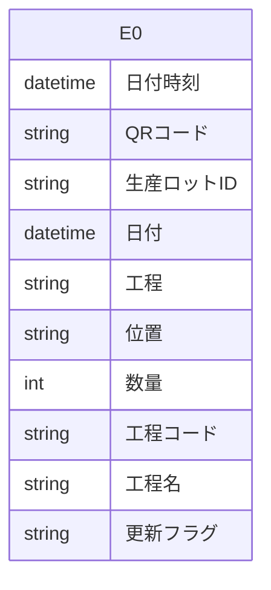

# Access データベース・スキーマ抽出レポート

このファイルは **Access の ODBC メタデータ**から自動生成しました。
LLM に渡す場合は **「スキーマ JSON」セクション**と **「PostgreSQL DDL 草案」**をあわせて指示に含めると、目的の RDB に近い定義を再現しやすくなります。

## LLM / AI 向け: このドキュメントの使い方

以下をプロンプトにコピーして、目的の SQL ダイアレクト（例: PostgreSQL）向け **CREATE TABLE・INDEX・FK** を生成させてください。

```text
あなたはデータベース設計者です。添付 Markdown の次を根拠に、一貫したリレーショナルスキーマを設計してください。
1) YAML フロントマターと「サマリー」の数値
2) 「スキーマ JSON（機械可読・全量）」の tables / relationships / warnings
3) 「PostgreSQL DDL 草案」は参考用。型・NULL・FK・インデックスを JSON・列定義と突き合わせて修正すること。
4) ODBC が SYNONYM としたテーブルはリンク元の実体が別にある場合がある。移行時はデータ取得元を明示すること。
5) relationships が空のときは、列名・サンプルデータから FK を推論してよいが、推論はコメントで区別すること。
出力: (a) 最終 DDL (b) 設計上の想定・未確定事項の箇条書き
```

> ⚠ FK 取得スキップ: t_QR履歴保存 — ('IM001', '[IM001] [Microsoft][ODBC Driver Manager] ドライバーはこの関数をサポートしていません。 (0) (SQLForeignKeys)')
> ⚠ VBA 抽出失敗: (-2147352567, '例外が発生しました。', (0, None, '指定した式に、Visible プロパティに対する正しくない参照が含まれます。', 'dao360.chm', 2015567, -2146825833), None)

## サマリー

| 項目 | 値 |
|---|---|
| Access ファイル | `\\192.168.1.200\共有\QRシステム\Access\QR履歴保存DB.accdb` |
| ODBC ドライバ | `Microsoft Access Driver (*.mdb, *.accdb)` |
| テーブル数 | 1 |
| 行数合計（取得できたテーブルのみ） | 346,689 |
| リンクテーブル相当（ODBC: SYNONYM） | 0 |
| 外部キー（検出分） | 0 |
| ビュー / クエリ名 | 0 |
| 警告 | 2 |

## ER 図（Mermaid・参考）

Mermaid 内のエンティティは `E0`, `E1`, … です。実テーブル名は次の対応表を参照してください。

| 記号 | テーブル名 | ODBC 型 | 行数 |
|---|---|---:|---:|
| E0 | `t_QR履歴保存` | TABLE | 346,689 |



## PostgreSQL DDL 草案（全文・自動生成）

```sql
-- PostgreSQL DDL 草案（Access メタデータから自動生成）
-- ※ 型・制約は必ず手動で確認・修正してください

CREATE TABLE "t_QR履歴保存" (
    "日付時刻" TIMESTAMP,
    "QRコード" VARCHAR(22),
    "生産ロットID" VARCHAR(7),
    "日付" TIMESTAMP,
    "工程" VARCHAR(2),
    "位置" VARCHAR(2),
    "数量" INTEGER,
    "工程コード" VARCHAR(2),
    "工程名" VARCHAR(30),
    "更新フラグ" VARCHAR(1)
);
```

## スキーマ JSON（機械可読・全量）

以下をパースすれば、テーブル・列・PK・インデックス・サンプル・統計・FK・ビュー名を一括で渡せます。

```json
{
  "export_spec": "access-inspector/schema-export/v1",
  "generated_at": "2026-06-15T04:09:47.951739+00:00",
  "source": {
    "database_path": "\\\\192.168.1.200\\共有\\QRシステム\\Access\\QR履歴保存DB.accdb",
    "driver_used": "Microsoft Access Driver (*.mdb, *.accdb)"
  },
  "summary": {
    "table_count": 1,
    "sum_row_count_where_known": 346689,
    "tables_with_row_count": 1,
    "linked_table_odbc_synonym_count": 0,
    "relationship_count": 0,
    "view_count": 0,
    "warning_count": 2
  },
  "notes_for_consumer": [
    "ODBC の table_type が SYNONYM のテーブルは Access のリンクテーブルであることが多い。",
    "PostgreSQL 型ヒントは参考。最終 DDL は業務要件とデータ実態で確認すること。",
    "relationships が空でも、命名規則やサンプル行から推定された FK があり得る。"
  ],
  "tables": [
    {
      "name": "t_QR履歴保存",
      "table_type": "TABLE",
      "row_count": 346689,
      "row_count_error": null,
      "primary_key": [],
      "columns": [
        {
          "name": "日付時刻",
          "access_type": "DATETIME",
          "sql_data_type": 9,
          "column_size": 19,
          "decimal_digits": 0,
          "nullable": true,
          "postgres_type_hint": "TIMESTAMP"
        },
        {
          "name": "QRコード",
          "access_type": "VARCHAR",
          "sql_data_type": -9,
          "column_size": 22,
          "decimal_digits": null,
          "nullable": true,
          "postgres_type_hint": "VARCHAR(22)"
        },
        {
          "name": "生産ロットID",
          "access_type": "VARCHAR",
          "sql_data_type": -9,
          "column_size": 7,
          "decimal_digits": null,
          "nullable": true,
          "postgres_type_hint": "VARCHAR(7)"
        },
        {
          "name": "日付",
          "access_type": "DATETIME",
          "sql_data_type": 9,
          "column_size": 19,
          "decimal_digits": 0,
          "nullable": true,
          "postgres_type_hint": "TIMESTAMP"
        },
        {
          "name": "工程",
          "access_type": "VARCHAR",
          "sql_data_type": -9,
          "column_size": 2,
          "decimal_digits": null,
          "nullable": true,
          "postgres_type_hint": "VARCHAR(2)"
        },
        {
          "name": "位置",
          "access_type": "VARCHAR",
          "sql_data_type": -9,
          "column_size": 2,
          "decimal_digits": null,
          "nullable": true,
          "postgres_type_hint": "VARCHAR(2)"
        },
        {
          "name": "数量",
          "access_type": "INTEGER",
          "sql_data_type": 4,
          "column_size": 10,
          "decimal_digits": 0,
          "nullable": true,
          "postgres_type_hint": "INTEGER"
        },
        {
          "name": "工程コード",
          "access_type": "VARCHAR",
          "sql_data_type": -9,
          "column_size": 2,
          "decimal_digits": null,
          "nullable": true,
          "postgres_type_hint": "VARCHAR(2)"
        },
        {
          "name": "工程名",
          "access_type": "VARCHAR",
          "sql_data_type": -9,
          "column_size": 30,
          "decimal_digits": null,
          "nullable": true,
          "postgres_type_hint": "VARCHAR(30)"
        },
        {
          "name": "更新フラグ",
          "access_type": "VARCHAR",
          "sql_data_type": -9,
          "column_size": 1,
          "decimal_digits": null,
          "nullable": true,
          "postgres_type_hint": "VARCHAR(1)"
        }
      ],
      "indexes": [],
      "sample_headers": [
        "日付時刻",
        "QRコード",
        "生産ロットID",
        "日付",
        "工程",
        "位置",
        "数量",
        "工程コード",
        "工程名",
        "更新フラグ"
      ],
      "sample_rows": [
        [
          "2021-01-05T08:42:51",
          "P056222201228012A04740",
          "P056222",
          "2021-01-05T00:00:00",
          "3",
          "1",
          0,
          "90",
          "磁気ﾊﾞﾚﾙ",
          "1"
        ],
        [
          "2021-01-05T08:51:07",
          "P055781201219006A04549",
          "P055781",
          "2021-01-05T00:00:00",
          "1",
          "1",
          1399,
          "01",
          "洗浄",
          "1"
        ],
        [
          "2021-01-05T08:58:33",
          "P055816201220006A04549",
          "P055816",
          "2021-01-05T00:00:00",
          "1",
          "1",
          1430,
          "01",
          "洗浄",
          "1"
        ],
        [
          "2021-01-05T09:02:53",
          "P056082201221006A04549",
          "P056082",
          "2021-01-05T00:00:00",
          "1",
          "1",
          639,
          "01",
          "洗浄",
          "1"
        ],
        [
          "2021-01-05T09:09:03",
          "P056229201228022A04740",
          "P056229",
          "2021-01-05T00:00:00",
          "3",
          "1",
          0,
          "90",
          "磁気ﾊﾞﾚﾙ",
          "1"
        ]
      ],
      "column_stats": [
        {
          "column": "日付時刻",
          "null_count": 0,
          "null_rate_pct": 0.0,
          "unique_count": null,
          "unique_rate_pct": null
        },
        {
          "column": "QRコード",
          "null_count": 0,
          "null_rate_pct": 0.0,
          "unique_count": null,
          "unique_rate_pct": null
        },
        {
          "column": "生産ロットID",
          "null_count": 0,
          "null_rate_pct": 0.0,
          "unique_count": null,
          "unique_rate_pct": null
        },
        {
          "column": "日付",
          "null_count": 0,
          "null_rate_pct": 0.0,
          "unique_count": null,
          "unique_rate_pct": null
        },
        {
          "column": "工程",
          "null_count": 0,
          "null_rate_pct": 0.0,
          "unique_count": null,
          "unique_rate_pct": null
        },
        {
          "column": "位置",
          "null_count": 0,
          "null_rate_pct": 0.0,
          "unique_count": null,
          "unique_rate_pct": null
        },
        {
          "column": "数量",
          "null_count": 0,
          "null_rate_pct": 0.0,
          "unique_count": null,
          "unique_rate_pct": null
        },
        {
          "column": "工程コード",
          "null_count": 55,
          "null_rate_pct": 0.0,
          "unique_count": null,
          "unique_rate_pct": null
        },
        {
          "column": "工程名",
          "null_count": 102,
          "null_rate_pct": 0.0,
          "unique_count": null,
          "unique_rate_pct": null
        },
        {
          "column": "更新フラグ",
          "null_count": 0,
          "null_rate_pct": 0.0,
          "unique_count": null,
          "unique_rate_pct": null
        }
      ]
    }
  ],
  "relationships": [],
  "views_and_queries": [],
  "vba_modules": [],
  "warnings": [
    "FK 取得スキップ: t_QR履歴保存 — ('IM001', '[IM001] [Microsoft][ODBC Driver Manager] ドライバーはこの関数をサポートしていません。 (0) (SQLForeignKeys)')",
    "VBA 抽出失敗: (-2147352567, '例外が発生しました。', (0, None, '指定した式に、Visible プロパティに対する正しくない参照が含まれます。', 'dao360.chm', 2015567, -2146825833), None)"
  ]
}
```

## テーブル一覧

| テーブル | ODBC 型 | 行数 | PK | インデックス数 |
|---|---|---:|---|---:|
| `t_QR履歴保存` | TABLE | 346,689 | — | 0 |

## カラム詳細

### `t_QR履歴保存`

- **ODBC テーブル種別**: TABLE
- **行数**: 346,689

| 列 | Access 型 | PG 型ヒント | sql_data_type | サイズ | 小数 | NULL | PK |
|---|---|---|---:|---:|---:|:---:|:---:|
| 日付時刻 | DATETIME | TIMESTAMP | 9 | 19 | 0 | ○ |  |
| QRコード | VARCHAR | VARCHAR(22) | -9 | 22 |  | ○ |  |
| 生産ロットID | VARCHAR | VARCHAR(7) | -9 | 7 |  | ○ |  |
| 日付 | DATETIME | TIMESTAMP | 9 | 19 | 0 | ○ |  |
| 工程 | VARCHAR | VARCHAR(2) | -9 | 2 |  | ○ |  |
| 位置 | VARCHAR | VARCHAR(2) | -9 | 2 |  | ○ |  |
| 数量 | INTEGER | INTEGER | 4 | 10 | 0 | ○ |  |
| 工程コード | VARCHAR | VARCHAR(2) | -9 | 2 |  | ○ |  |
| 工程名 | VARCHAR | VARCHAR(30) | -9 | 30 |  | ○ |  |
| 更新フラグ | VARCHAR | VARCHAR(1) | -9 | 1 |  | ○ |  |

**カラム統計**

| 列 | NULL件数 | NULL率% | ユニーク件数 | ユニーク率% |
|---|---:|---:|---:|---:|
| 日付時刻 | 0 | 0.0 | None | None |
| QRコード | 0 | 0.0 | None | None |
| 生産ロットID | 0 | 0.0 | None | None |
| 日付 | 0 | 0.0 | None | None |
| 工程 | 0 | 0.0 | None | None |
| 位置 | 0 | 0.0 | None | None |
| 数量 | 0 | 0.0 | None | None |
| 工程コード | 55 | 0.0 | None | None |
| 工程名 | 102 | 0.0 | None | None |
| 更新フラグ | 0 | 0.0 | None | None |

**サンプルデータ（先頭数行）**

| 日付時刻 | QRコード | 生産ロットID | 日付 | 工程 | 位置 | 数量 | 工程コード | 工程名 | 更新フラグ |
|---|---|---|---|---|---|---|---|---|---|
| 2021-01-05T08:42:51 | P056222201228012A04740 | P056222 | 2021-01-05T00:00:00 | 3 | 1 | 0 | 90 | 磁気ﾊﾞﾚﾙ | 1 |
| 2021-01-05T08:51:07 | P055781201219006A04549 | P055781 | 2021-01-05T00:00:00 | 1 | 1 | 1399 | 01 | 洗浄 | 1 |
| 2021-01-05T08:58:33 | P055816201220006A04549 | P055816 | 2021-01-05T00:00:00 | 1 | 1 | 1430 | 01 | 洗浄 | 1 |
| 2021-01-05T09:02:53 | P056082201221006A04549 | P056082 | 2021-01-05T00:00:00 | 1 | 1 | 639 | 01 | 洗浄 | 1 |
| 2021-01-05T09:09:03 | P056229201228022A04740 | P056229 | 2021-01-05T00:00:00 | 3 | 1 | 0 | 90 | 磁気ﾊﾞﾚﾙ | 1 |

## リレーション（外部キー）

（検出なし、またはドライバが FK メタデータを返しませんでした）

## ビュー / クエリ

（なし）

## VBA モジュール

（取得なし — オプションで「VBAコードを取得」を有効にして再取得してください）
